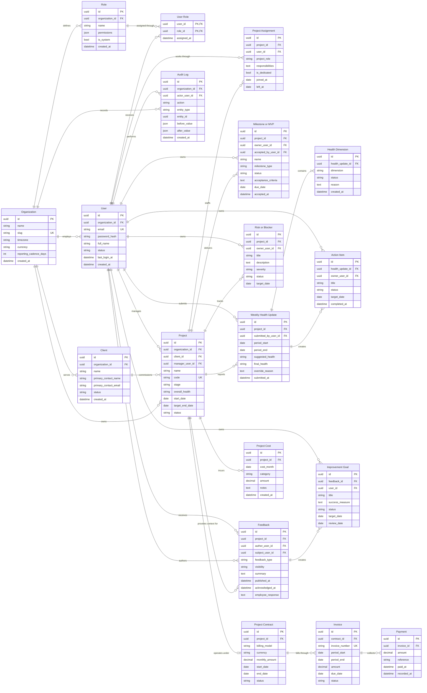

# Database ERD — Version 1

This is the initial relational model for the internal project, team, feedback,
health, milestone, and financial management platform.

The diagram intentionally focuses on important keys and business fields. Audit
columns such as `updated_at`, `deleted_at`, and `updated_by` can be added
consistently in migrations without making the ERD unreadable.

## Important modeling decisions

- Roles and permissions are organization-scoped, while project responsibilities
  live on `project_assignments`.
- Project health is stored as immutable weekly snapshots with separate
  dimensions for schedule, scope, quality, client sentiment, and team condition.
- A milestone records manual MVP acceptance, including who accepted it and when.
- Feedback separates author and recipient and supports employee acknowledgement
  without turning feedback into an automatic performance score.
- Financial information is anchored to a project contract and then separated
  into invoices, payments, and operational project-cost estimates.
- Sensitive changes are captured in an append-only audit log.
